# Projectmaster

## Overview

Run projects through a deliberate operating system instead of improvising. Use `superpowers` as the control plane, then pull in Matt Pocock's skills where they improve design quality, execution discipline, and finish confidence.

## Master Flow

```dot
digraph projectmaster {
    rankdir=LR;
    start [label="New project or major change", shape=box];
    classify [label="Classify project type", shape=diamond];
    brainstorm [label="brainstorming", shape=box];
    grill [label="grill-with-docs", shape=box];
    setup [label="setup-matt-pocock-skills\nif repo not configured", shape=box];
    plan [label="writing-plans", shape=box];
    execute [label="subagent-driven-development\nor executing-plans", shape=box];
    tdd [label="tdd", shape=box];
    debug [label="diagnosing-bugs", shape=box];
    review [label="requesting-code-review", shape=box];
    verify [label="verification-before-completion", shape=box];
    finish [label="handoff or branch-finish", shape=box];

    start -> classify -> brainstorm -> grill -> setup -> plan -> execute -> tdd -> review -> verify -> finish;
    tdd -> debug [style=dashed];
    debug -> tdd [style=dashed];
}
```



## Start Here

### 1. Classify the work

Before choosing a path, decide what kind of work this is:

- Greenfield project: little or no existing code, many product decisions still open
- Major feature: existing codebase, but meaningful scope and cross-file impact
- Recovery or rescue: codebase is already messy, tangled, or unclear
- Prototype: speed matters more than polish, but the prototype still needs a boundary
- Bugfix: behavior is wrong and root cause is not yet proven

If the work contains multiple independent subsystems, break it into separate tracks before implementation.

### 2. Shape the project before coding

Start with `brainstorming`.

- Use it to clarify goal, scope, constraints, non-goals, and success criteria.
- Stay in design mode until the project shape is explicit.
- If the request is large, decompose it into sub-projects and only fully design the first one.

### 3. Pressure-test assumptions

Use `grill-with-docs` unless the work is genuinely tiny.

- Prefer it for anything with architecture, workflows, data models, UX tradeoffs, or team-facing consequences.
- Use it to establish shared language and record the decisions that would otherwise stay implicit.
- If terminology is already messy, this step is mandatory.

### 4. Initialize the repo-level engineering contract

If the repository has not been prepared for Matt Pocock's engineering skills, run `setup-matt-pocock-skills` once per repo.

Use it to configure:

- issue tracker expectations
- triage labels
- domain documentation layout

Do this early for long-lived projects so later skills have a stable operating context.

### 5. Turn design into execution

Use `writing-plans`.

- Convert the approved design into a concrete implementation plan.
- Break the work into small steps with file paths, tests, commands, and expected results.
- If the plan still feels vague, return to `brainstorming` or `grill-with-docs` instead of pushing ahead.

### 6. Choose execution mode deliberately

Pick one:

- `subagent-driven-development`: default for real projects, multi-step features, or work that benefits from clean checkpoints
- `executing-plans`: use for smaller or more linear tasks where staying in one session is simpler

Default to `subagent-driven-development` unless the task is clearly small and sequential.

### 7. Build with test discipline

Use `tdd`.

- write the failing test first
- verify the failure is meaningful
- implement the minimum code to pass
- refactor only while green

For throwaway prototypes, explicitly decide whether strict TDD can be relaxed. Never silently skip it.

### 8. Switch modes when blocked

If behavior becomes confusing, flaky, or contradictory, stop implementing and use `diagnosing-bugs`.

- reproduce
- minimize
- hypothesize
- instrument
- verify root cause

Only return to `tdd` once the bug is actually understood.

### 9. Review before claiming success

Before saying the project is done:

- use `requesting-code-review`
- use `verification-before-completion`

If the work will be handed off, paused, or resumed later, finish with `handoff`.

## Recommended Paths

### Greenfield product path

Use for a new app, service, tool, or internal system:

1. `brainstorming`
2. `grill-with-docs`
3. `setup-matt-pocock-skills`
4. `writing-plans`
5. `subagent-driven-development`
6. `tdd`
7. `requesting-code-review`
8. `verification-before-completion`

### Major feature path

Use for a substantial feature inside an existing codebase:

1. `brainstorming`
2. `grill-with-docs`
3. `writing-plans`
4. `subagent-driven-development` or `executing-plans`
5. `tdd`
6. `diagnosing-bugs` when needed
7. `verification-before-completion`

### Recovery path

Use when the codebase already feels heavy, muddy, or poorly structured:

1. `grill-with-docs`
2. `improve-codebase-architecture`
3. `writing-plans`
4. `subagent-driven-development`
5. `tdd`
6. `diagnosing-bugs`
7. `requesting-code-review`
8. `verification-before-completion`

### Fast path

Use only when scope is clear and consequences are limited:

1. `brainstorming`
2. `writing-plans`
3. `executing-plans`
4. `tdd`
5. `verification-before-completion`

### Bugfix path

Use when the issue is already user-visible or correctness-sensitive:

1. `systematic-debugging` or `diagnosing-bugs`
2. `writing-plans` if the fix is non-trivial
3. `tdd`
4. `requesting-code-review`
5. `verification-before-completion`

## Decision Table

| Situation | Start with |
| --- | --- |
| Idea is still fuzzy | `brainstorming` |
| Need sharper requirements and language | `grill-with-docs` |
| Repo must be prepared for engineering workflows | `setup-matt-pocock-skills` |
| Need an implementation roadmap | `writing-plans` |
| Need to execute a serious plan | `subagent-driven-development` |
| Need to code safely | `tdd` |
| Bug is confusing or stubborn | `diagnosing-bugs` |
| Codebase has become a ball of mud | `improve-codebase-architecture` |
| Need final confidence before done | `verification-before-completion` |
| Need to pause or transfer the work | `handoff` |

## Required Outputs

The project should usually produce these artifacts in order:

1. approved design
2. implementation plan
3. tested code changes
4. review feedback or explicit review pass
5. verification result
6. optional handoff note

If any of these are missing on non-trivial work, the project likely skipped a phase.

## Common Failure Modes

- Starting in `tdd` before the project is clear enough to test
- Treating `grill-with-docs` as optional on complex work
- Writing a plan before the design is actually approved
- Staying in execution mode when the real problem is diagnosis
- Skipping `setup-matt-pocock-skills` in a repo that will rely on those workflows
- Declaring completion based on code changes instead of verification evidence

## Invocation Examples

Use prompts like:

```text
Use projectmaster and start this new project with the full path.
```

```text
Use projectmaster for this feature and choose the right path before coding.
```

```text
Use projectmaster for this messy codebase and guide me through the recovery path.
```
